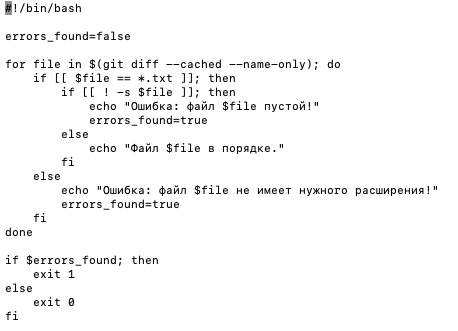
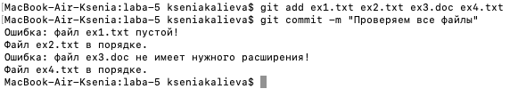

# Лабораторная работа 5

## Задание 1 - Автоматизация проверки формата файлов при коммите

- Создаю отдельную директорию, куда копирую репозиторий
- Перехожу в директорию hooks с помощью `cd .git/hooks`
- Создаю bash-скрипт внутри файла pre-commit, который будет выполнять проверку того, что коммитится файл формата .txt и в файле присутствует какой-то текст:



Подробнее о коде проверки:


Теперь данный скрипт готов к работе при коммитах

Создаю несколько файлов для проверки корректности работы Хука:

`ex1.txt` - оставляю пустым

`ex3.doc` - файл другого расширения

`ex4.txt` - пишу внутрь файла какой-то текст

Далее делаю коммит измененных файлов
```
git add ex1.txt ex2.txt ex3.doc ex4.txt
git commit -m "Проверка файлов"
```

и скрипт выводит информацию сразу для всех файлов. (в ex2.txt тоже записала какой-то текст, аналогичный ex4.txt файл)



## Задание 2 - Использование Git Flow в проекте
 
Предположим, у вас есть задача на создание новой функциональности для вашего проекта с использованием Git Flow. Давайте рассмотрим конкретный пример. В примере важен не сам проект и его код (его тут вообще как такового нет), а принцип работы Git Flow.

1. Установила Git Flow через терминал:

```
brew install git-flow
```

2. В корне репозитория выполнила инициализацию Git Flow.

```
git flow init
```

3. Создаю ветку для новой функциональности "task-management":

```
git flow feature start task-management
```

4. Внесла изменения в код для добавления функционала управления задачами ( для этого создала файл task_manager.py):

```
def create_task(title, description):
    # Логика создания задачи
    print(f"Создана новая задача: {title}")
```

Выполните коммит изменения по мере разработки:

```
git add task_manager.py
git commit -m "Добавлен функционал управления задачами"


```

5. После завершения разработки функции завершите фичу и объедините ее с основной веткой:

```
git flow feature finish task-management

```

Git Flow автоматически переключится на ветку develop и выполнит слияние. Если есть конфликты, их нужно разрешить.

6. Переключитесь на ветку "develop" и начните создание релиза:

```
git checkout develop
git flow release start v1.0.0
```

7. Внесите изменения, связанные с релизом (например, обновите версию в файле version.txt):

```
echo "v1.0.0" > version.txt
git add version.txt
git commit -m "Обновлена версия для релиза v1.0.0"

```

8. Завершите релиз и объедините его с ветками "develop" и "main":

```
git flow release finish v1.0.0
```

9. Если в процессе использования выявлена критическая ошибка, создайте hotfix (у нас конечно же ошибки никакой не возникнет, но hotfix все равно создаем):

```
git flow hotfix start hotfix-1.0.1
```

10. Внесите изменения для исправления ошибки и коммитите:

```
# Исправление ошибки
git add file_with_error.py
git commit -m "Исправлена критическая ошибка"
```

11. Завершите hotfix и объедините его с ветками "develop" и "main":

```
git flow hotfix finish hotfix-1.0.1
```

12. Завершение работы и отправка изменений на удаленный репозиторий. Отправьте изменения на удаленный репозиторий:

```
git push origin develop
git push origin main

```
### Как успешно сдать работу?

Создать свой репозиторий из шаблона этого. Как это делается - "Use this template" -> "Create a new repository" и сделайте его public. 

Находясь уже в своем репозитории - создайте новый файл формата .md и там оформляйте отчет. В отчете опишите все шаги которые вы делали, чтобы получить финальный результат работы.

Что вам нужно знать, чтобы успешно защитить работу:

Основные команды Git, как возникают и как решать конфликты, Git Hooks, Git Flow. 

## Ресурсы

1. [Git Documentation](https://git-scm.com/doc)
2. [Atlassian Git Tutorial](https://www.atlassian.com/git/tutorials)
3. [Pro Git Book](https://git-scm.com/book/en/v2)
4. [Markdown Guidelines](https://docs.github.com/ru/get-started/writing-on-github/getting-started-with-writing-and-formatting-on-github/basic-writing-and-formatting-syntax)
